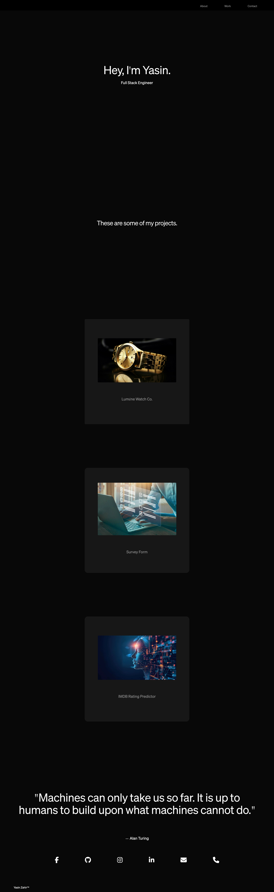

# Personal Portfolio Website

## Overview

This is a personal portfolio website showcasing some of my notable projects. The website is clean, minimalist, and responsive, designed using HTML, CSS, and custom fonts. It includes sections for "About", "Work", and "Contact", with interactive elements and links to my social media accounts and contact information.

## Features

- **Responsive Design**: The website is fully responsive and adjusts its layout according to different screen sizes, from mobile to desktop.
- **Custom Font**: It uses a custom `Sohne` font for a sleek and professional look.
- **Flex Layout**: The layout also contains CSS Flex, ensuring an organized and modern structure.
- **Grid Layout**: The layout is based on CSS Grid, for enhanced positioning to supplement CSS Flex
- **Interactive Hover Effects**: Each section and project features hover effects to improve user interaction.
- **Project Showcase**: Displays three key projects with images and links to their respective GitHub repositories:
    1. **Luméne Watch Co.** – A modern product landing page.
        - [View on GitHub](https://github.com/YasoJan/Lumene-Watch-Co.)
    2. **Survey Form** – A basic form created to gather feedback from users.
        - [View on GitHub](https://github.com/YasoJan/Survey-Form)
    3. **IMDB Rating Predictor** – A tool that predicts movie ratings based on user data.
        - [View on GitHub](https://github.com/YasoJan/IMDB-Rating-Predictor)

## Technologies Used

- **HTML5**: Structuring the content of the website.
- **CSS3**: Custom styles, including responsive design with media queries, grid layout, and animations.
- **FontAwesome**: Icons for social media and contact links.
- **Custom Fonts**: The website uses the 'Sohne' font for a unique and professional appearance.




## Project Structure

```bash
├── index.html
├── styles.css
├── images/
│   ├── Product_demo.jpg
│   ├── survey_form.jpg
│   └── imdb-pic.webp
├── fonts/
│   └── TestSohne-Buch-BF663d89cd32e6a.otf
└── README.md 
